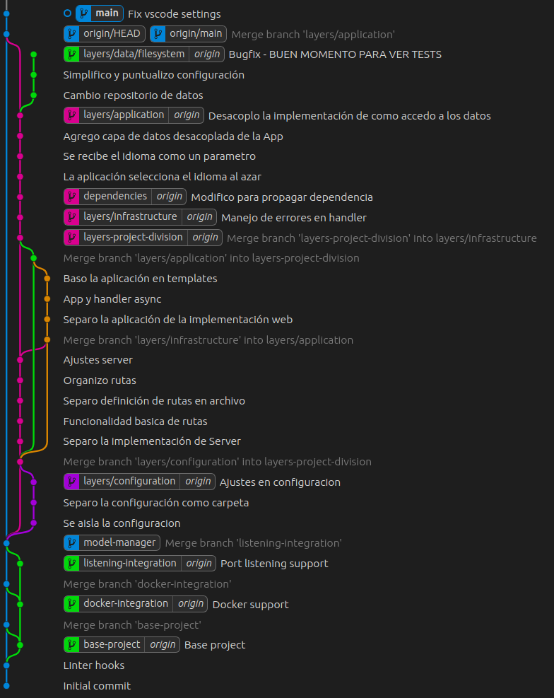

# Boilerplate NodeJS

Proyecto de ejemplo para capacitación en abstracción y segmentación paso a paso.

> Este repositorio alberga un proyecto de ejemplo diseñado para aplicar progresivamente los conceptos aprendidos en nuestra capacitación. Cada branch del proyecto se construye desde cero, siguiendo un enfoque paso a paso, donde se aplican los conocimientos adquiridos en la formación. De esta manera, los participantes pueden seguir de cerca la evolución del proyecto y comprender cómo se aplican los conceptos teóricos en la práctica.

## Branches


## Scripts

## Install and prepare

```bash
npm install --save-dev husky prettier eslint
npm npx eslint --init
npm run prepare
npm run build
```

## Creation 

```bash
npm init -y
npm install --save-dev husky prettier eslint
npm npx -y eslint --init

npm pkg set scripts.prepare="husky install"
npm run prepare

npx husky add .husky/pre-commit "npx -y lint-staged"
```
